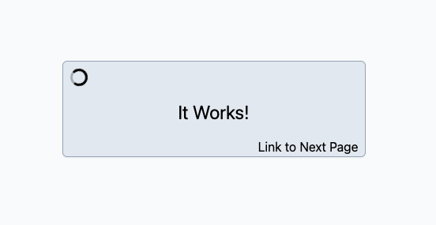
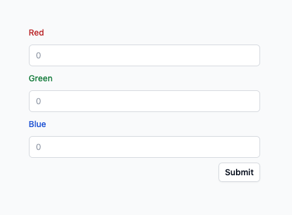
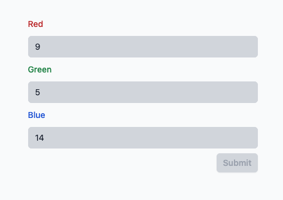
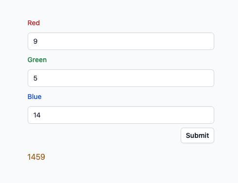

# Developer Evaluation Task

To complete this task successfully, you will need to be proficient with:

- Git, Github
- Node, `npm` and `npx`
- Angular and the `ng` CLI, TypeScript
- NgRx, RxJS
- Tailwind CSS

You will also need a computer ready with the tools necessary to work with the above. Please make sure that you have these installed to the latest versions.

This task should not take any longer than **1-2 hours**. As timing is a factor, please ensure that you have an uninterrupted period of time allocated.

Please follow the instructions carefully. Take careful note of the `git push` steps.

Your output will be checked against:

- Task completion and accuracy
- Implementation
- Code cleanliness and consistency
- Timing

Additionally:

- For the purposes of this evaluation, Unit Tests will not be required.
- All layout and styling in this project should use Tailwind CSS. Exact colours and spacing are not important, but general alignment is.
- No AI-Generative code may be used in this evaluation.
- Feel free to use the `ng` CLI to scaffold code as required. `@ngrx/schematics` may also be useful.
- Do not add any other libraries to this project other than those explicitly stated.

If you are unsure of any instruction, continue as best you can with your understanding of what is required.

## Part 1.

- Create a private, empty repository in Github named `angular-evaluation-application-${your-name}`. Invite the Github user `angular-evaluator` to collaborate on this respository.
- On your local computer, generate an empty Angular Project using the `ng` CLI.
- Add the latest NgRx and Tailwind libraries.
- Configure NgRx and Tailwind to work within the project.
- Replace the default landing page with a simple centre-aligned message box stating "It Works!"
  - Include a placeholder link at the bottom-right of the box for later user.
- Set your new Github repository as `remote`, commit the project and push to remote `main` with the message `"Part 1 Complete"`.

## Part 2.

- Create an Angular Service called `EvaluatorService`.
- Expose a function from this service called `concatenate` which accepts an argument of type `{ [k: string]: number }` and returns an observable of type `string`.
  - This function should concatenate the object values of this parameter, alphabetically ordered by the object keys.
  - This result, however, should only be returned after 2 seconds delay.
  - eg. `{ ant: 2, cricket: 4, bee: 3 }` should wait 2 seconds before returning `"234"`
- Expose a second function from this service called `parity` which accepts an argument of type `{ [k: string]: number }` and returns an observable of type `boolean`.
  - This function should add the object values of this parameter and return `true` if the sum of these values is even and `false` if the sum is odd.
  - This result should return immediately.
  - eg. `{ ant: 2, cricket: 4, bee: 3 }` should return `false`.
- Commit these changes and push to remote `main` with the message `"Part 2 Complete"`.

## Part 3.

- Create a global NgRx store call `AppState`. Ensure that it is correctly initialised on application startup.
- Associated with this store and using the standard redux pattern, create three actions called `increaseBusy`, `decreaseBusy` and `clearBusy`, as well as a selector called `isBusy`.
- At app-startup, the `isBusy` selector should emit `false`.
- When an `increaseBusy` action is dispatched, the `isBusy` selector should emit `true`.
- If, after this, a `descreaseBusy` action is dispatched, the `isBusy` selector should emit `false`.
- If more `increaseBusy` actions than `decreaseBusy` actions have been dispatched, the `isBusy` selector should emit `true`.
- When the same number of `decreaseBusy` actions as `increaseBusy` actions have been dispatched, the `isBusy` selector should emit `false`.
- More `decreaseBusy` dispatches than `increaseBusy` dispatches should be considered a logical error. For now, simply log this to the console and continue as if it had been ignored.
- When the `clearBusy` action is dispatched, the busy state should be reset to its' initial state causing `isBusy` to emit false.
- On the default landing page, include a spinner indicator that spins when `isBusy` is true, and is hidden when `isBusy` is false. (see image-pt2)
  - Use any available SVG spinner, such as this one: [ring-spinner](https://github.com/n3r4zzurr0/svg-spinners/blob/main/svg-css/270-ring-with-bg.svg)
- Commit these changes and push to remote `main` with the message `"Part 3 Complete"`.

## Part 4.

- Create another page in the project (ie. an Angular Component) and configure standard routing to that page. Link to this new page using the Link placeholder from the default landing page. (see Part 1)
- The logic of this page may be implemented either using RxJS Observables or Angular Signals. Ensure that the component is ready to use whichever you choose to implement.
- Add a Reactive form with 3 standard number fields and a "Submit" button. The form fields should be called `red`, `green` and `blue`.

- For each field, the minimum acceptable value is `3` and the maximum is `15`. Each field is required.
- If the form is not in a valid state or if the app is in a busy state (as per `isBusy`), the Submit button and controls should be disabled.

- If the button is enabled and pressed, the values of the form should be put into an object with the form field names as the object keys and the form values as the object values. eg. `{ red: 5, green: 12, blue: 9}`.
- This object should be passed to a function that:
  - Dispatches the `increaseBusy` action.
  - Passes the object simultaneously to both the `concatenate` and the `parity` functions of the `EvaluatorService`.
  - Waits for all functions to complete before dispatching the `decreaseBusy` action.
  - Records the returned values locally.
- Expose these values to the local component via an Observable or Signal.
- On the page, display these two values like so:
  - If there is no concatenate value, then show nothing.
  - If there is a concatenate value, display the value in orange if `parity` returned `true` (ie. the value is even) or yellow if `parity` returned `false`. (ie. the number is odd).
- Commit these changes and push to remote `main` with the message `"Part 4 Complete"`.

When you have completed this task, please reach out to me on Discord and let me know.

I will evaluate your work as soon as possible and arrange a suitable time to continue the interview process
